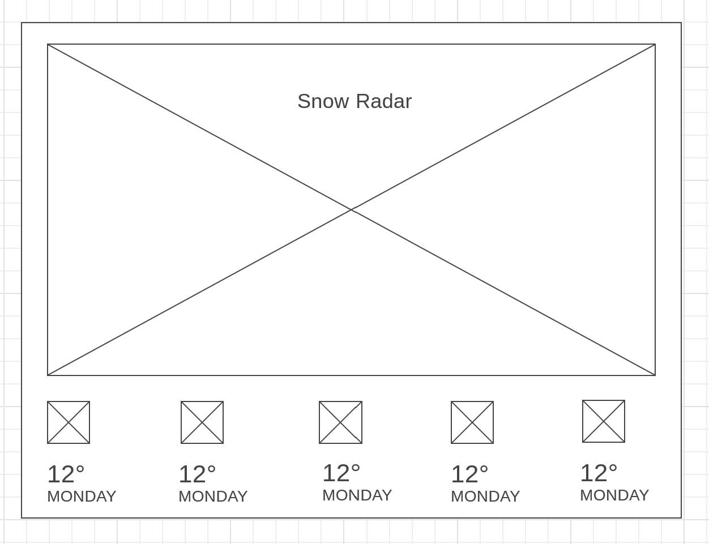

# SnowPlowNews Weather Station

We are going to make a snow radar and 5-day forecast using:

* *LeafletJS* - Mapping
* *Openweathermap* - Snow data and 5-day forecast
* [leaflet-openweathermap](https://github.com/buche/leaflet-openweathermap) - A JavaScript library for including OpenWeatherMap's layers and OWM's current city/station data in leaflet based maps without hassle.

### Wireframe:

[Edit WireframeCC](https://wireframe.cc/GXOhus)